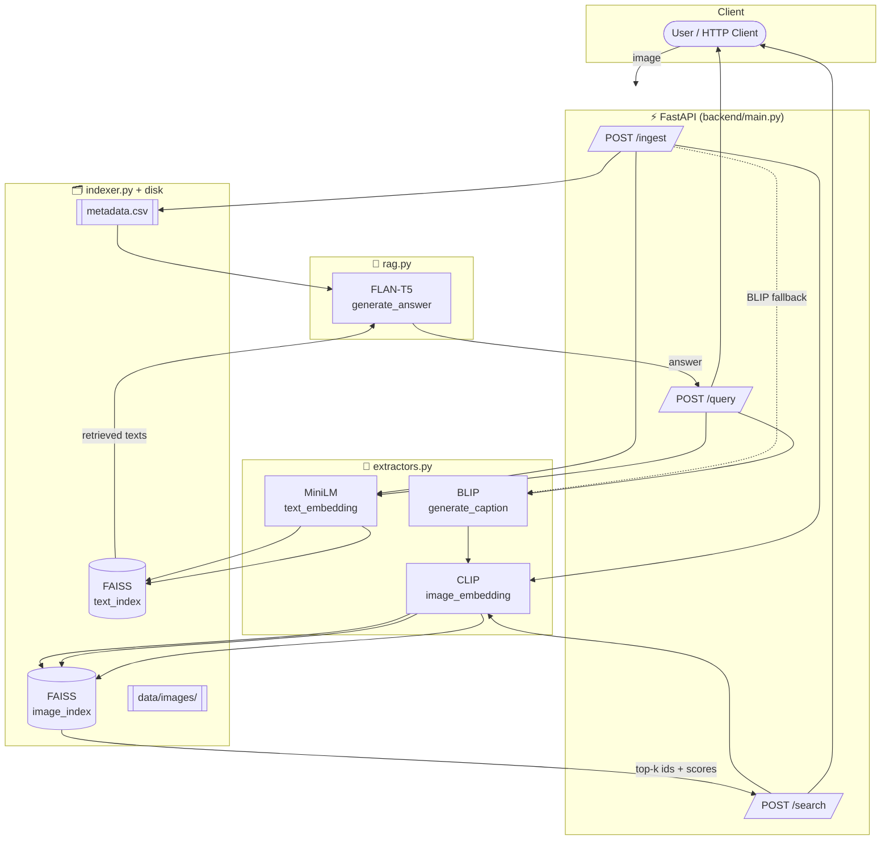

<div align="center">

# 🌃 Image-to-Text Retrieval System — Multimodal Search

### Caption · Retrieve · Reason — a CLIP + BLIP + FAISS + FLAN-T5 RAG pipeline, served over FastAPI

<p>
  
  
  
  
  
  
  
  
</p>

</div>

---

## 📖 Overview

This project takes an input image and runs it through a **multimodal retrieval-augmented pipeline**:

1. **Caption** the image with **BLIP**.
2. **Embed** the image with **CLIP** and the caption with **Sentence-Transformers (MiniLM)**.
3. **Retrieve** the most similar images and texts from **FAISS** indexes.
4. **Reason** over the retrieved context with **FLAN-T5** to answer a free-form question.

Originally a Google Colab notebook, it has been ported into a clean, local **FastAPI** backend with three endpoints. **No model/function logic was rewritten** during the port — the `generate_caption`, `image_embedding`, `text_embedding`, `FaissIndex`, and `generate_answer` implementations are copied verbatim from the notebook; only Colab-specific glue (Drive mounts, `files.upload()`, ngrok tunnels) was removed and one path bug was fixed.

---

## 🏗️ Architecture



**Pipeline at a glance:**

| Stage | Component | Model / Tool |
|-------|-----------|--------------|
| Captioning | `generate_caption` | `Salesforce/blip-image-captioning-base` |
| Image embedding | `image_embedding` | `openai/clip-vit-base-patch32` |
| Text embedding | `text_embedding` | `all-MiniLM-L6-v2` |
| Vector search | `FaissIndex` | FAISS `IndexFlatIP` (cosine via normalized vectors) |
| Answer generation | `generate_answer` | `google/flan-t5-small` |

---

## 📁 Project Structure

```
.
├── backend/
│   ├── extractors.py   # generate_caption, image_embedding, text_embedding  (verbatim)
│   ├── indexer.py      # FaissIndex class                                    (verbatim)
│   ├── rag.py          # generate_answer                                     (verbatim)
│   └── main.py         # FastAPI app — /ingest, /search, /query
├── data/
│   └── images/         # image dataset  (img_001.jpg … img_007.jpg)
├── indexes/            # FAISS index files written by /ingest
├── metadata.csv        # id, filename, caption, tags, description
├── requirements.txt
└── README.md
```

---

## 🔌 API Endpoints

| Method | Route | Description |
|--------|-------|-------------|
| `POST` | `/ingest` | Runs the indexing loop over `metadata.csv` and builds + saves the FAISS image & text indexes. |
| `POST` | `/search` | Multipart `file` (+ optional `top_k`). Returns the top-k most similar dataset images via CLIP. |
| `POST` | `/query` | Multipart `file` (+ optional `question`). Full pipeline: caption → retrieve → `generate_answer`. |

### Example requests

```bash
# 1. Build the indexes (run once after adding images)
curl -X POST http://127.0.0.1:8000/ingest

# 2. Find similar images
curl -X POST http://127.0.0.1:8000/search \
  -F "file=@/path/to/query.jpg" \
  -F "top_k=5"

# 3. Ask a question about an image
curl -X POST http://127.0.0.1:8000/query \
  -F "file=@/path/to/query.jpg" \
  -F "question=What technology or weapon is visible?"
```

---

## 🚀 Getting Started

```bash
# 1. Install dependencies
pip install -r requirements.txt

# 2. Add your dataset images to data/images/  (matching the filenames in metadata.csv)

# 3. Launch the API
uvicorn backend.main:app --reload

# 4. Open the interactive docs
#    http://127.0.0.1:8000/docs
```

> ⚠️ **First run downloads models** (BLIP, CLIP, MiniLM, FLAN-T5) from Hugging Face — this can take a few minutes and several GB. Subsequent runs use the local cache. Runs on CPU; uses CUDA automatically if available.

---

## 🔧 Notes on the Colab → FastAPI Port

| Change | Detail |
|--------|--------|
| **Removed** | `drive.mount()`, `google.colab.files.upload()`, `pyngrok` / ngrok tunneling, Colab `!shell` cells. |
| **File uploads** | Now handled by FastAPI `UploadFile` + `python-multipart` instead of `files.upload()`. |
| **Paths** | `PROJECT_ROOT` is derived from the backend folder location (local filesystem), replacing the hard-coded Drive path. |
| **🐛 Bug fixed** | Image paths were built as `os.path.join(PROJECT_ROOT, "data_metadata_template.csv", filename)` — a **filename used as a folder**, so lookups always failed. Corrected to `os.path.join(PROJECT_ROOT, "data", "images", filename)` in all three places. |
| **Logic** | The five core functions/classes were **copied verbatim** — no logic was rewritten or "improved". |

---

## 🧬 Tech Stack

**Models:** BLIP · CLIP · Sentence-Transformers (MiniLM) · FLAN-T5
**Serving:** FastAPI · Uvicorn · python-multipart
**Vector search:** FAISS (`IndexFlatIP`)
**Core:** PyTorch · Hugging Face Transformers · NumPy · pandas · Pillow

<div align="center">

---

Made with ⚡ for multimodal retrieval

</div>
